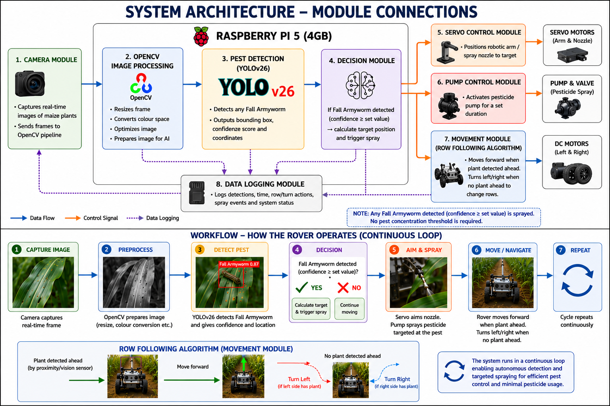

The project was made using python3 and nicegui web framework. This ensures that the rover's UI is accessible to any device on its network.

import { Card, CardGrid, LinkButton } from '@astrojs/starlight/components';

<CardGrid stagger>
  <Card title="Python">
    
  </Card>
  <Card title="NiceGUI">  
    
  </Card>
</CardGrid>

<LinkButton href="https://github.com/CodersCreative/vermis-files" variant="secondary">
  Check it out on GitHub!
</LinkButton>

