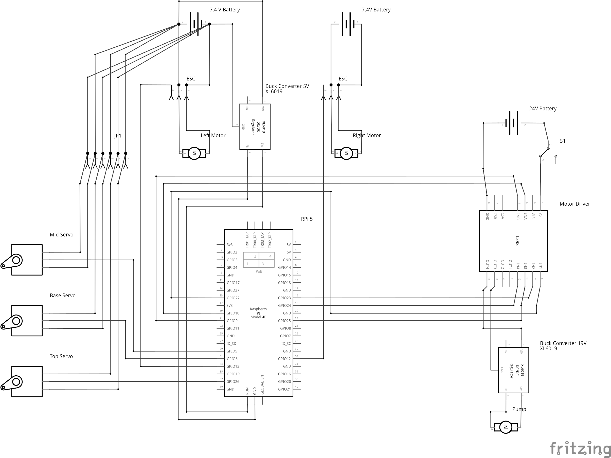

It is made of a couple of well defined parts and problems that we had to deal with individually and combine together to produce a finished product:

import { Card, CardGrid, LinkButton } from '@astrojs/starlight/components';

<CardGrid stagger>
  <Card title="Sensors">
    Sensory data received from 3 cameras.
    1 camera in front and 1 in the back of the rover to receive images of the surroundings for navigation.
    The other camera is fixed on the robotic arm to capture video frames of maize plants so that fall armyworm can be detected
  </Card>
  <Card title="LEDs">  
    We equipped the rover with low-cost energy-efficient LEDs that can adequately light up its surroundings at night for the use of the integrated camera.
    This gives our rover ability to work at night and reduce the timeframe required to finish field operations
  </Card>
  <Card title="Power Supply">  
    We made use of two high-capacity 20,000 mAh 7.2V batterirs designed to fulfill a maximum of 12 hours of work continuously.
    This ensures that the rover can cover a large area before requiring recharging or a battery exchange.
  </Card>
  <Card title="Raspberry Pi 5">  
    To ensure the rover was able to process large amounts of information quickly and efficiently whilst easily controlling the various components,
    we decided that a Raspberry Pi 5 would be the best device to have at the heart of it.
  </Card>
  <Card title="Water and Dust Proofing">  
    By using silicone caulk on all the joints between body panels and on any other open arean we achieved an estimated IP rating of IP-54.
  </Card>
</CardGrid>

The circuit board was designed using Fritzing, so that our circuit diagram is well documented and replicable.

