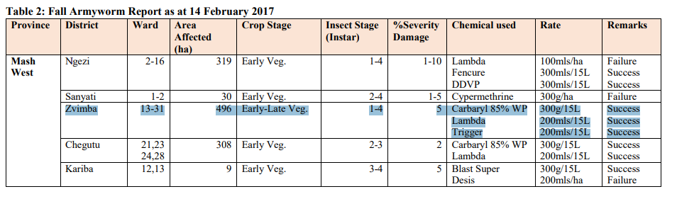

According to CAB International and EurekAlert; in Zimbabwe,
farmers that are affected by army worms are 12% more likely to experience hunger
and in the country results in annual losses from just maize of $83 million.
Furthermore an investigation led by Dr Justice Tambo found that a 44% reduction in individual household income
and a 17% increase in the likelihood of hunger were observed under conditions of severe infestation.
Findings show that households failing to combat fall armyworm saw per-person income fall by 50%,
while those that took control measures suffered no significant income loss.

To combat the infestation, farmers typically relied on synthetic pesticides and the manual collection of egg masses and larvae.
Supplementary tactics included filling maize whorls with ash or sand,
the application of detergents, and the rogueing and subsequent burning of affected vegetation.

The effects of this pest vary wildly across various parts of the Zimbabwean economy.
The issue is also commonly seen across sub-saharan Africa where it causes an estimated crop loss of up to $13 billion.  

According to the table made by the Ministry of Agriculture, Mechanization and Irrigation Development Department of Research and Specialist Services,
the pesticide is effective especially in Mashonaland West, Zvimba, the location of Rainham.
This shows that the key problem is ineffective application and lack of resources and funds.

