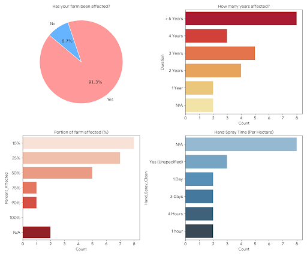
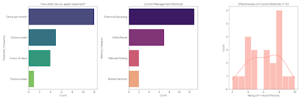
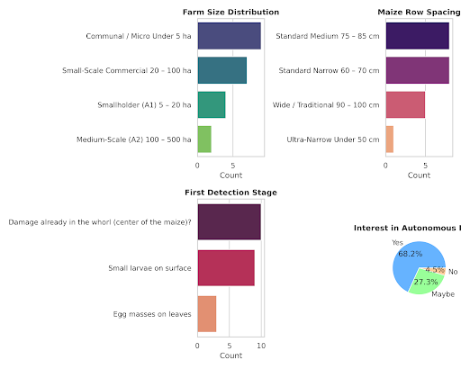
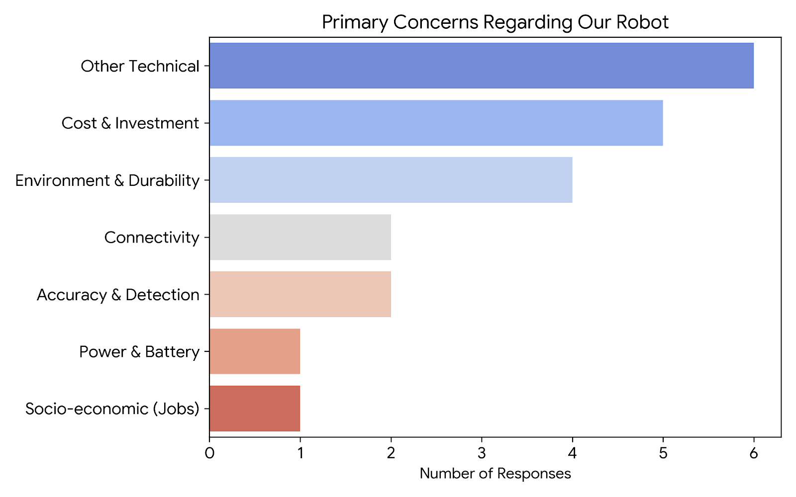

To get a better understanding of the situation and to get real local statistics, we ran a questionnaire with local farmers, particularly those in the Rainham area.
The following are the questions that 24 farmers filled out.

Initially after coming up with the project we decided that our greatest resource was the wealth of knowledge found in farmers all across the country.
So we decided to reach out to a selected group of farmers and ask them questions related to the project.

After the questionnaire we would directly speak to some of the most affected farmers to help come up with the requirements
that would make the project as effective in a farming environment as possible.

Overall we managed to compile responses from 23 separate farmers who responded to these questions:

import { Card, CardGrid, LinkButton } from '@astrojs/starlight/components';

<LinkButton href="https://docs.google.com/forms/d/e/1FAIpQLScScMJPvhBp3KjSo0ptMYJZ1JcJV9YeCrx_LPXpxSF7pjD8QA/viewform" variant="secondary">
  See It Yourself
</LinkButton>

## The Questions

  <iframe src="https://docs.google.com/forms/d/e/1FAIpQLScScMJPvhBp3KjSo0ptMYJZ1JcJV9YeCrx_LPXpxSF7pjD8QA/viewform?embedded=true" style="width:100%;height:900px;border:0;" frameborder="0" marginheight="0" marginwidth="0" loading="lazy">Loading…</iframe>

## The Results

<CardGrid stagger>
  <Card>
    
  </Card>
  <Card>  
    
  </Card>
  <Card>  
    
  </Card>
  <Card>  
    
  </Card>
</CardGrid>

## Interpretation of Graphs and Key Learning Points

Based on the survey data for Project VERMIS, it is clear that our robot must be designed as a highly adaptable solution to meet the diverse needs of the farming community.

Our robot needs to address a persistent crisis,
as the majority of farmers have been struggling with Fall Armyworm for three to over five years.
Because many users only detect the pest once damage is already visible deep in the maize whorl,
our robot's computer vision must be sensitive enough to identify larvae even in these recessed areas.
Physically, our robot must feature an adjustable chassis to accommodate varying row widths, which range from narrow 60–70 cm paths to wide 100 cm traditional spacing.
Without this physical flexibility, our robot  would risk crushing crops on the very farms it is meant to service.

We have identified several critical "must-haves" that our robot must satisfy to win over skeptical users:

<CardGrid stagger>
  <Card title="Economic Viability">
    Our robot must be affordable with low running costs, as farmers are wary of high capital investments for smaller hectares.
  </Card>
  <Card title="Infrastructure Independence">  
    To be useful in remote areas, our robot needs to operate effectively without requiring constant internet or network connectivity.
  </Card>
  <Card title="All-Weather Durability">  
    Our robot must be ruggedized to handle difficult terrain and continue operating during the rainy season.
  </Card>
  <Card title="Efficiency Over Manual Labor">  
    Since current hand-spraying methods can take between one and three days per hectare,
    our robot must significantly reduce this timeframe to provide a clear return on investment.
  </Card>
  <Card title="Targeted Accuracy">
    Our robot must achieve higher precision than the manual "ash, sand, and detergent" methods currently used,
    especially since farmers currently rate their own effectiveness between only 4 and 8 out of 10.  
  </Card>
</CardGrid>
