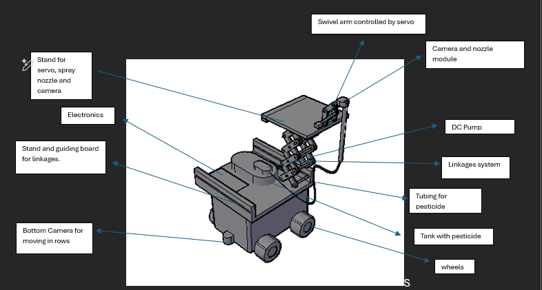
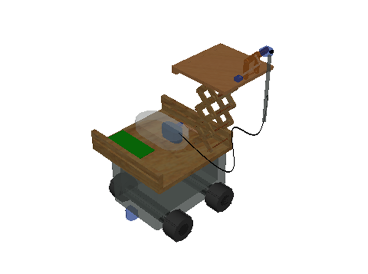
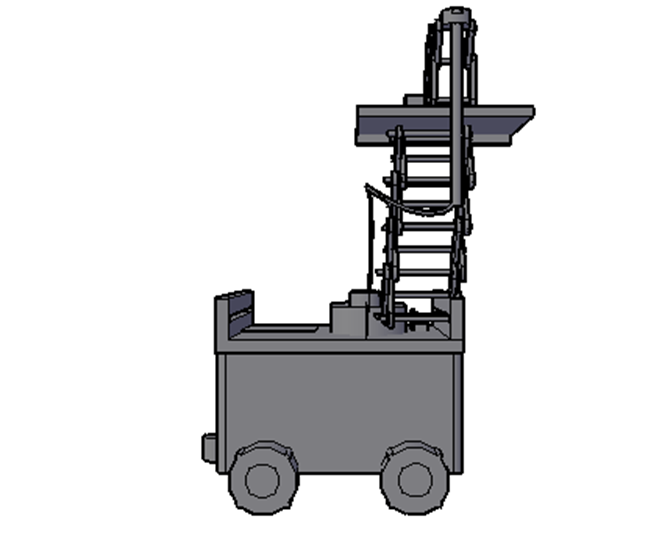
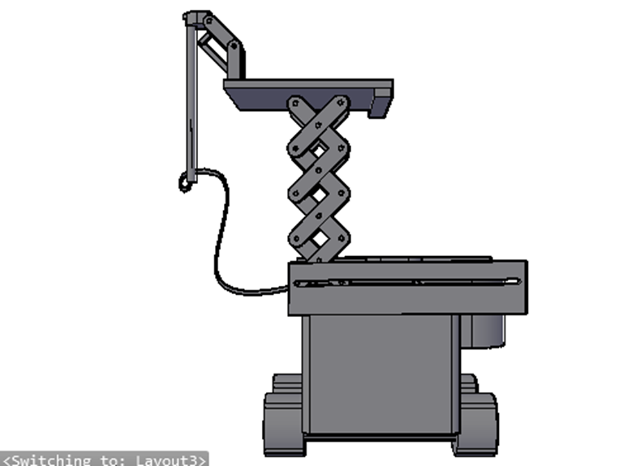
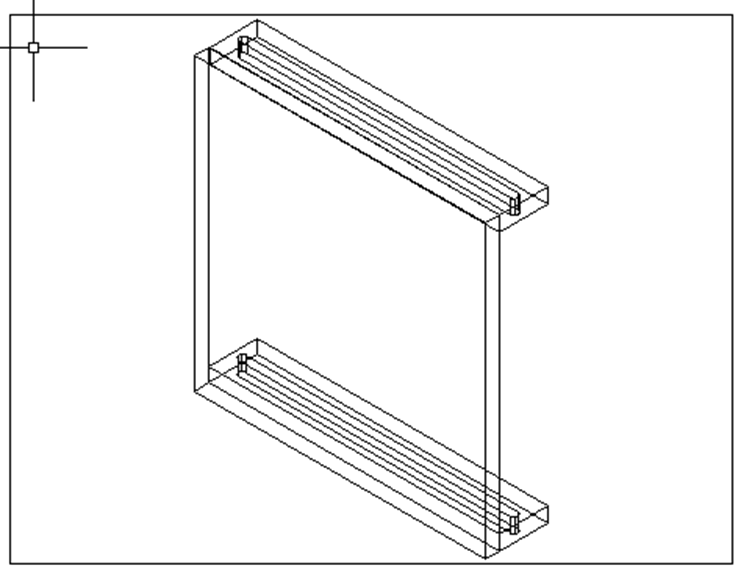
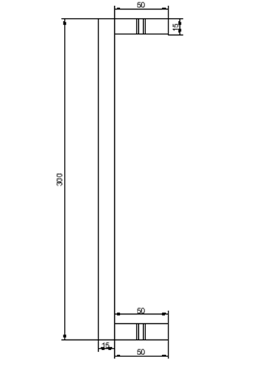
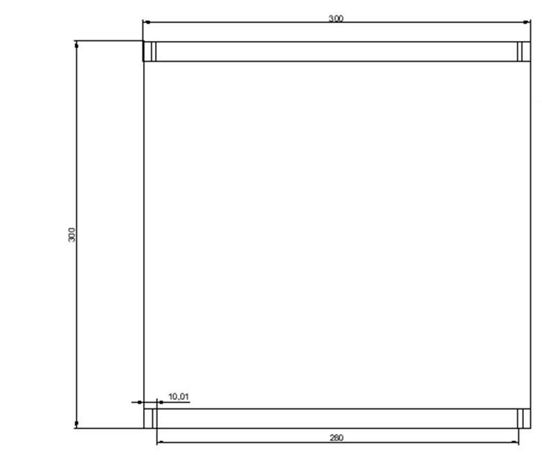
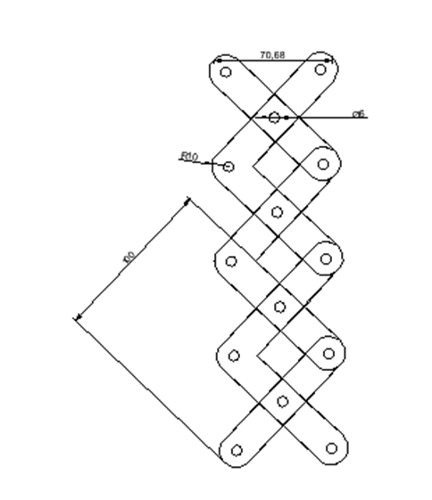
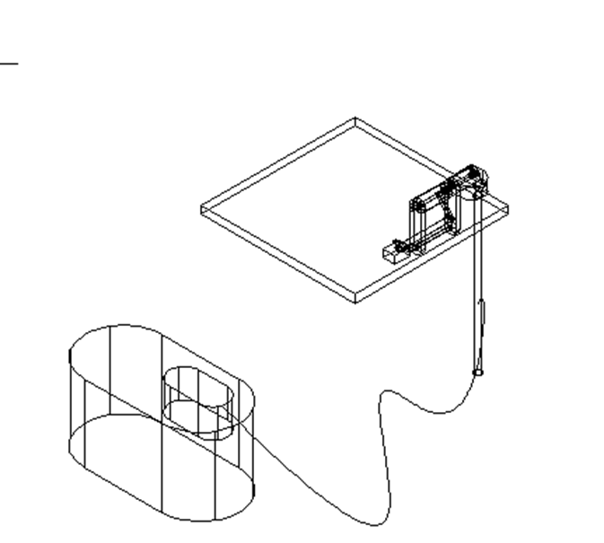
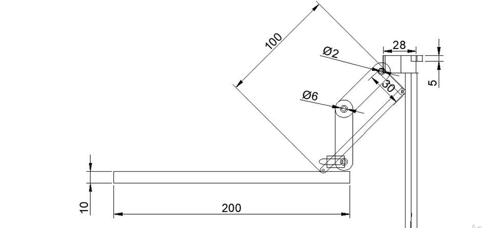

The rover’s physical architecture was developed using AutoCAD to ensure precision in hardware integration.
The Autocad designs are also compatible with laser cutting devices.

## The Prototype

### Realistic Material View

### Side Views

import { Card, CardGrid, LinkButton } from '@astrojs/starlight/components';

<CardGrid stagger>
  <Card>
    
  </Card>
  <Card>  
    
  </Card>
</CardGrid>

### Linkages System

<CardGrid stagger>
  <Card>
    
  </Card>
  <Card>  
    
  </Card>
  <Card>
    
  </Card>
  <Card>  
    
  </Card>  
</CardGrid>

### Spraying System

<CardGrid stagger>
  <Card>
    
  </Card>
  <Card>  
    
  </Card>
</CardGrid>

#### Problem Faced

In our initial prototype, the DC pump was mounted above the reservoir.
This required the pump to create a partial vacuum to lift the pesticide against gravity - a process known as suction lift.
However, we encountered significant performance issues.
The small DC pumps used in our rover are typically centrifugal and are more efficient at pushing fluid than pulling it.
The resistance caused by the vertical displacement led to inconsistent spray patterns and frequent "priming" issues,
where air trapped in the line prevented the pump from moving any liquid at all. To resolve this, we overhauled the tank architecture,
moving the pump to a sub-tank position. By placing the pump beneath the reservoir, we converted the system into a gravity-fed configuration.
This ensures the pump inlet is constantly flooded with liquid,
eliminating air locks and utilizing the hydrostatic pressure of the pesticide to assist the motor.

To quantify the benefit of this move, we calculated the hydrostatic pressure (P) exerted at the bottom of the tank.
This pressure is a function of the liquid's density (ρ), the acceleration due to gravity (g), and the height of the liquid column (h).

##### Calculations

##### Results

By relocating the pump, we gained approximately 3.0 kPa of "free" pressure.
While 3004 Pa may seem modest, it is sufficient to overcome the internal friction of the pump's valves and ensure an immediate,
high-pressure spray upon activation. This change significantly improved the reliability of the activate_pump() function in our code,
as the software no longer had to account for the "lag" time previously required to prime the spray line.
