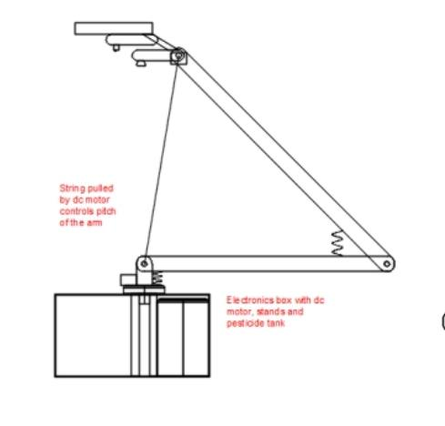
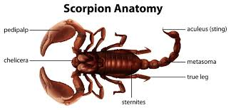

It has segments with servos to allow the rover to move in all directions.
The three servo motors on the arm joints allow the arm to move into all directions into any position in space.

This design is inspired by the movement of the metasoma of scorpions.
