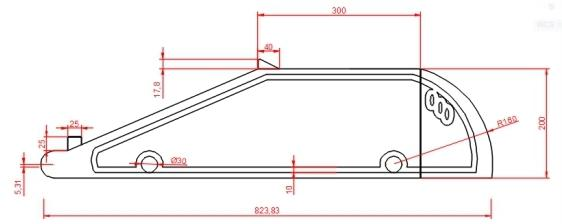

This is very important in improving rover navigation in the field.
This ensures minimum damage to overhanging maize leaves and ensures stability of the rover in sloping fields due to lower centre of mass.
The rover was intended to be made using teak wood which is cheap and locally available.
