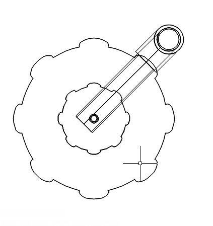
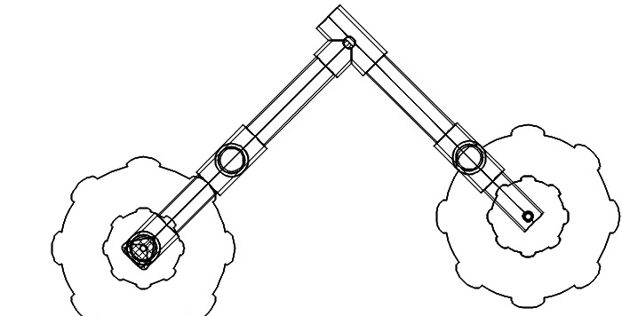
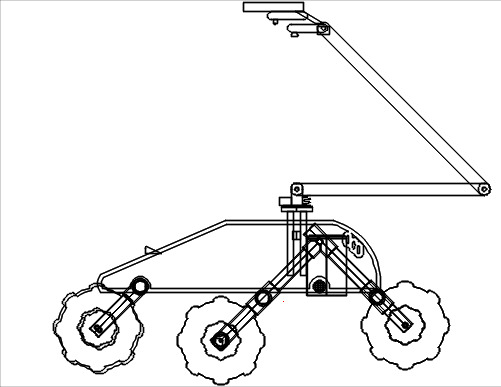
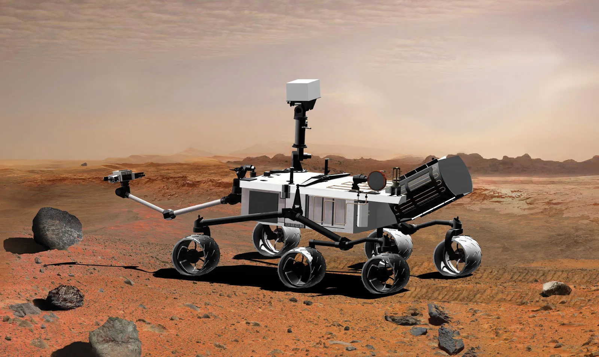

import { Card, CardGrid, LinkButton } from '@astrojs/starlight/components';

<CardGrid stagger>
  <Card>
    
  </Card>
  <Card>  
    
  </Card>
  <Card>  
    
  </Card>
</CardGrid>

We chose this design to enhance mobility and stability of the rover on uneven surfaces in the field by allowing each wheel to pivot independently.
This design also allows for better weight distribution on the rover

This design is inspired by the curiosity mars rover.
